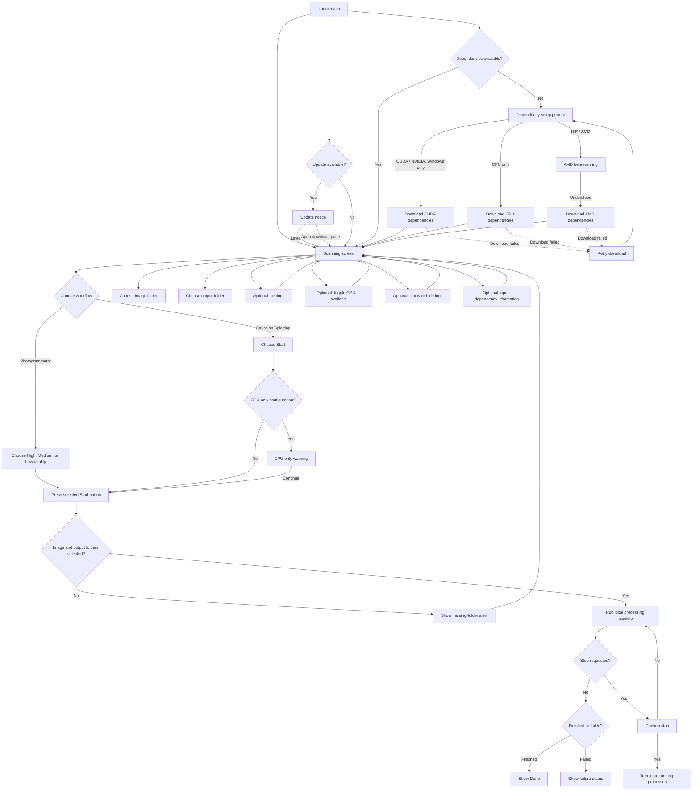

# UI Flow and User Choices

This document describes the decisions and options exposed by the desktop UI.
Some controls and dependency prompts are conditional on the selected compute
configuration or operating system.

## Flow

The folder, workflow, settings, GPU, and log controls can be changed on the
scanning screen before starting a run. The update notice is optional; choosing
its download link opens the release page in a browser.

## User Choices

| Area | Choices and behavior |
| --- | --- |
| Workflow | **Photogrammetry** creates a textured mesh. **Gaussian Splatting** runs the splat training workflow. Selecting splatting in a CPU-only configuration shows a warning, but still offers **Continue**. |
| Image input | Select or change the folder containing source images. |
| Output | Select or change the folder where generated files will be written. Both folders are required to start. |
| Photogrammetry quality | **High**, **Medium**, or **Low**. These select different image-resolution, reconstruction, and decimation settings. |
| Gaussian Splatting start | A single **Start** button is shown; there are no separate quality buttons. |
| GPU use | **Use GPU when possible** can be toggled when the configured compute type is not CPU-only. It is hidden in CPU-only mode. |
| CPU threads | Freeform **Max Cpu Threads** setting; `-1` means all threads. Default: `-1`. |
| Feature matching | **exhaustive_matcher** or **sequential_matcher**. Default: `exhaustive_matcher`. |
| Sequential overlap | Freeform **Sequential Matcher Overlap** value. Default: `30`; relevant when sequential matching is selected. |
| Meshing engine | **OpenMVS** or **PoissonRecon**. Default: PoissonRecon. |
| OpenMVS arguments | Shown for OpenMVS: freeform additional arguments. Default: `--target-face-num 0 --crop-to-roi 1 --roi-border 10`. |
| PoissonRecon arguments | Shown for PoissonRecon: freeform additional arguments. Default: `--pointWeight 10 --samplesPerNode 2 --confidence`. |
| SurfaceTrimmer arguments | Also shown for PoissonRecon: freeform additional arguments. Default: `--removeIslands`. |
| Splat training steps | Freeform **Splat Training Steps** value. Default: `30000`. |
| Dependency installation | If dependencies are reported missing, the prompt offers CPU-only and HIP/AMD choices; CUDA/NVIDIA is offered on Windows. AMD selection has a beta warning and an **Understood** confirmation. A failed download offers **Retry**. |
| Re-download dependencies | Available under Application Settings; opens the same dependency setup choices. |
| Run controls | Pressing **Start** without both required folders shows an alert and returns to the scanning screen. While running, **Stop** asks for confirmation: **Yes** terminates active processes; **No** returns to the run. |
| Logs | **View Logs** / **Hide Logs** toggles the process log panel. |
| Dependency information | The question-mark control opens links for COLMAP, OpenMVS, mvs-texturing, pymeshlab, Brush, and PoissonRecon. |
| Update notice | When an update is detected, the user can open the latest-release page or choose **Later**. |

### Notes

- Dependency availability is checked at startup. In the current implementation,
  Linux is treated as having its dependencies available; the interactive
  download choices are normally relevant to Windows.
- The settings are exposed as editable text fields and dropdowns. The app
  passes these values to the processing commands; this UI does not provide
  per-setting validation or a separate save action.
- Although **Sequential Matcher Overlap** is shown whenever settings are open,
  it only affects the sequential matcher path.